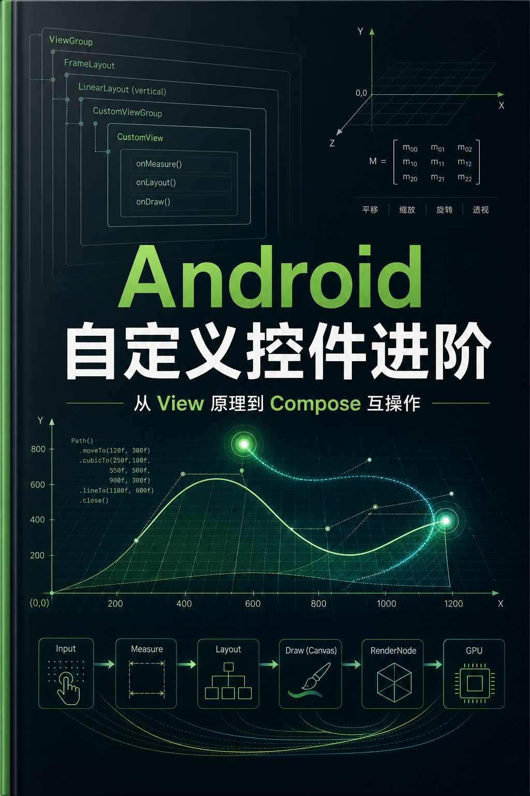

# Android 自定义控件进阶



一本面向具备 Kotlin 与 Android 基础的开发者的进阶教材。

本书以传统 View 体系为主线，系统讲解测量、布局、绘制、事件分发、复杂手势、自定义 ViewGroup、动画、性能、状态、无障碍、测试以及 Compose 互操作，并通过可组合的工具类和生产级控件案例将知识串联起来。

## 阅读方式

```bash
npm ci
npm run serve
```

构建静态站点：

```bash
npm run check
npm run build
```

生成结果位于 `_book/`。Windows 下推荐直接运行 `read.cmd`，它会在需要时自动构建、启动稳定的静态服务器并打开浏览器；也可以执行 `npm run read`。编辑书稿并需要 LiveReload 时再使用 `serve.cmd`。不要直接双击 `_book/index.html`：HonKit 的页面导航与搜索依赖 HTTP 环境，在 `file://` 或部分本地文件预览容器中链接可能无法跳转。依赖审计与受信任输入边界见 [BUILDING.md](BUILDING.md)，完整验收证据见 [QA_REPORT.md](QA_REPORT.md)。

> 示例以 Kotlin、AndroidX 和现代 Android 工程实践为准。涉及 API 级别差异时，正文会明确标注。

## 适合读者

- 已掌握 Activity、Fragment、XML 布局与 Kotlin
- 想系统理解 View 底层机制
- 需要开发图表、编辑器、复杂交互控件或组件库
- 正在把传统 View 控件接入 Compose
